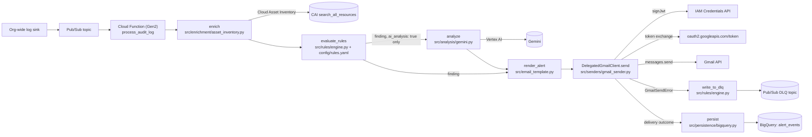

# GCP Audit Platform -- Gmail Alerting Layer

Sends severity-styled HTML alert emails for findings produced by the audit
log pipeline, using **keyless** Gmail API access (no service account key
file, ever) via IAM Credentials `signJwt` + domain-wide delegation (DWD).

## Architecture



## Auth flow (keyless domain-wide delegation)

The Cloud Function's runtime identity **is** the service account
`audit-platform-sa-prj-dg-devop@prj-dg-devops-test.iam.gserviceaccount.com`.
No key file is ever created, read, or referenced.

1. **Build claims**: `iss` = the service account, `sub` = the impersonated
   Workspace mailbox (`GMAIL_SENDER`), `scope` = `gmail.send` only,
   `aud` = the OAuth token endpoint, `iat`/`exp` = a 1-hour window.
2. **Sign**: `IAMCredentialsClient().sign_jwt(request={"name": ..., "payload":
   json.dumps(claims)})` -- Google holds the private key; this process never
   sees it. `payload` must be a JSON **string**.
3. **Exchange**: `POST https://oauth2.googleapis.com/token` with
   `grant_type=urn:ietf:params:oauth:grant-type:jwt-bearer` and
   `assertion=<signed_jwt>` -> `{"access_token": ..., "expires_in": ...}`.
4. **Build client**: `google.oauth2.credentials.Credentials(token=...)` +
   `googleapiclient.discovery.build("gmail", "v1", credentials=..., 
   cache_discovery=False)`.
5. **Send**: `service.users().messages().send(userId=<GMAIL_SENDER>, body=
   {"raw": <base64url MIME>})`. `userId` must equal the `sub` claim from
   step 1 -- a mismatch returns 404.

The access token is cached in-process (`DelegatedGmailClient`) and refreshed
300 seconds before expiry, guarded by a `threading.Lock` so concurrent warm
invocations don't race.

## Prerequisite IAM bindings

- `roles/iam.serviceAccountTokenCreator` on
  `audit-platform-sa-prj-dg-devop@prj-dg-devops-test.iam.gserviceaccount.com`,
  granted to itself (a service account signing its own JWT needs this role
  on itself when calling `signJwt` as its own identity) or to whichever
  identity invokes `probe_dwd.py` locally.
- The IAM Service Account Credentials API and Gmail API enabled on
  `prj-dg-devops-test`.
- `roles/cloudasset.viewer` (or broader) on the runtime service account, for
  `search_all_resources` enrichment.
- `roles/bigquery.dataEditor` on the `audit_platform` dataset (or the
  project), for `insert_rows_json`.
- `roles/pubsub.publisher` on the `DLQ_TOPIC`, for dead-lettering.
- `roles/aiplatform.user` on the project, for Gemini calls via Vertex AI --
  keyless: the Vertex AI SDK picks up the runtime service account's
  Application Default Credentials automatically, no key file involved.

## Workspace domain-wide delegation grant

Already registered per the task brief, for reference:

- Workspace Admin Console -> Security -> API Controls -> Domain-wide
  Delegation.
- OAuth client ID: `108550589402351078214`.
- Scope: exactly `https://www.googleapis.com/auth/gmail.send` (no other
  scopes).
- The impersonated mailbox (`GMAIL_SENDER`) must hold an active Gmail
  license.

## Local setup

The deployed runtime is pinned to Python 3.12 (`requires-python = ">=3.12,
<3.13"` in `pyproject.toml`, `--runtime=python312` in the deploy scripts).
If you don't have 3.12 installed locally:

```powershell
winget install --id Python.Python.3.12
```

Then:

```powershell
py -3.12 -m venv .venv
.venv\Scripts\Activate.ps1
pip install -r requirements.txt -r requirements-dev.txt
Copy-Item .env.example .env   # then edit .env with real values
```

## Verification order -- probe before you deploy

1. Authenticate locally with an identity that can impersonate the SA
   (`gcloud auth application-default login`), or run the probe from
   somewhere that already carries the target service account's identity.
2. `python scripts/probe_dwd.py <sender@yourdomain> ` -- confirms
   `signJwt` (stage 1) and the token exchange (stage 2) without sending
   anything.
3. `python scripts/probe_dwd.py <sender@yourdomain> --send-test <you@yourdomain>`
   -- adds an actual send (stage 3).
4. Only once all three stages print `OK` should you deploy.

## Deployment

Edit the variables block at the top of `scripts/deploy.ps1` (or
`scripts/deploy.sh`) -- `TOPIC`, `GMAIL_SENDER`, etc. -- and review
`config/routing.yaml` for correct recipients, then run the script for your
platform. Both scripts print the target project/account and require typing
`deploy` to proceed; both run `py_compile` and `pytest -q` first and abort
on failure.

```powershell
./scripts/deploy.ps1
```

```bash
./scripts/deploy.sh
```

## Infrastructure & CI/CD

There are now two ways to deploy, for two different purposes:

- **`scripts/deploy.ps1`/`.sh`** (above) -- local, imperative, `gcloud
  functions deploy`. Good for quick iteration against a personal/dev
  project. Unchanged from before this section existed.
- **Terraform + GitHub Actions** (`terraform/`, `.github/workflows/`) --
  declarative, code-reviewed, CI-applied. **This is the authoritative path
  for any real environment.** Terraform owns the Cloud Function resource
  itself (source zipped and uploaded via `data.archive_file` +
  `google_storage_bucket_object`, keyed by content hash so every code
  change produces a new revision), plus every other piece of
  infrastructure: Pub/Sub topics, the org-wide log sink, IAM, BigQuery, and
  observability. Running both paths against the same function will fight
  over drift -- pick one per environment.

### One-time setup (in order)

1. `terraform/bootstrap/` -- Workload Identity Federation pool/providers
   and the two GitHub Actions deploy service accounts (plan-only,
   apply-capable). Applied once, manually, by a human. See
   `terraform/bootstrap/README.md` for the exact commands and which
   outputs become which GitHub Actions repository variables.
2. Create the Terraform state bucket referenced in `terraform/backend.hcl`
   (command is in that file's header comment).
3. Configure the GitHub Actions repository variables listed in
   `.github/workflows/terraform.yml`'s header comment, and a `production`
   environment with required reviewers.
4. Copy `terraform/terraform.tfvars.example` to `terraform/terraform.tfvars`
   (gitignored) for any local `terraform plan`/`apply`, filling in the
   `PLACEHOLDER` values.

### Stack structure

```
terraform/
  bootstrap/            WIF + deploy SAs (separate state, manual, one-time)
  modules/
    logging/             org-wide aggregated sink -> Pub/Sub (deployment_mode-gated)
    pubsub/               main topic + DLQ topic/subscription/exhausted topic
    cloud_function/        the function itself + Eventarc-adjacent IAM
    iam/                   runtime SA's application permissions (least privilege)
    bigquery/               dataset + table (was the old flat bigquery.tf)
    monitoring/             log-based metrics + alert policies
  main.tf                 module composition only
  variables.tf, outputs.tf, providers.tf, versions.tf, backend.hcl
```

`deployment_mode` ("project_only" default, or "full") gates the org-level
log sink and its IAM so the stack applies cleanly without org-level
permissions on a first pass; "full" requires `org_id`.

### CI/CD pipeline

`.github/workflows/ci.yml` -- `ruff`/`mypy`/`pytest` on every push and PR
(mirrors `CLAUDE.md`'s Commands section exactly).

`.github/workflows/terraform.yml` -- on a PR touching `terraform/**`:
`terraform fmt -check` + `plan`, posted as a PR comment, using the
read-only plan SA. On a push to `main` touching `terraform/**`:
`terraform apply`, using the write-capable apply SA, gated behind the
`production` GitHub Environment's required reviewers.

### Known limitation: Cloud Function trigger dead-lettering

`google_cloudfunctions2_function`'s Pub/Sub trigger has no Terraform-
manageable `dead_letter_topic` field today (open upstream issue, see
`terraform/modules/pubsub/main.tf`'s header comment). Run
`scripts/configure_eventarc_dlq.ps1`/`.sh` once after the first `apply`
(and again after any trigger recreation) to attach a real dead-letter
policy to the Eventarc-managed subscription directly via `gcloud`.

### Observability

Four Cloud Monitoring alert policies (`terraform/modules/monitoring/`):
Cloud Function execution errors, DLQ backlog, a "no executions in 1h"
silent-breakage canary, and the app's own caught-and-logged failure
classes (Gmail send, DLQ write, BigQuery persist, malformed payload,
per-finding failures) surfaced as log-based metrics. No Terraform-managed
dashboard (see the module's header comment for why) -- see
`docs/RUNBOOK.md` for how to build one, and for what to actually do when
each alert fires.

## Adding a detection rule (YAML only -- never touch Python)

Every rule lives in `config/rules.yaml`, loaded and validated once at Cloud
Function cold start -- a malformed rule fails loudly there, not silently at
match time. To add one: copy the commented template rule at the bottom of
`config/rules.yaml`, give it a unique `id`, and fill in `title`, `severity`
(must be a key in `config/routing.yaml`'s `severity_styles`), a `match`
condition tree, and a `fields` map for what shows up in the email body. That
edit alone is enough -- `src/rules/engine.py` never needs to change.

`ai_analysis: true` triggers a Gemini call for every finding this rule
produces -- it costs money per finding, so reserve it for rules where a
human-judgment call ("is this legitimate?") genuinely adds value over a
mechanical fact ("a key was created").

### Condition tree

```text
all_of: [<condition>, ...]     true iff every child is true
any_of: [<condition>, ...]     true iff at least one child is true
not: <condition>                negation
{ field: <dotted path>, op: <operator>, value: <literal|list> }   leaf
```

`field` resolves against the enriched event: the first segment is one of
`method_name, principal_email, resource_name, resource_type, project_id,
severity, event_timestamp, raw_log_id, request_metadata, asset_labels,
asset_ancestors, enrichment_ok, raw`; everything after that walks into
dicts (by key) and lists (by index) -- e.g.
`raw.protoPayload.authenticationInfo.principalEmail`. A path that doesn't
resolve is a non-match for every operator except `not_exists`.

### Operator reference

| Operator | `value` | Semantics |
|---|---|---|
| `equals` | literal | Direct `==`; falls back to a narrow numeric-string-vs-number and bool-vs-`"true"/"false"`-string coercion only (never blanket stringification -- the YAML string `"None"` will not match a real null). |
| `not_equals` | literal | Negation of `equals`. |
| `contains` | literal | String value: substring check. Dict/list value: recursive search over **values only** (never dict keys), depth-capped at 25, short-circuits on first hit. Not correlation-aware across list elements -- see the caveat in `config/rules.yaml`. |
| `not_contains` | literal | Negation of `contains`. |
| `starts_with` | literal | String prefix, case-sensitive. |
| `ends_with` | literal | String suffix, case-sensitive. |
| `in` | list | Membership check (same coercion as `equals`); `value` must be a YAML list. |
| `not_in` | list | Negation of `in`. |
| `regex` | string | Precompiled at load time (bad pattern fails cold start); `re.search` -- **unanchored**, so always self-anchor allowlist patterns with `^...$`. Matched text capped to 4096 chars. |
| `exists` | (none) | True iff the dotted path resolves. |
| `not_exists` | (none) | True iff the dotted path does not resolve. |

All string comparisons are case-sensitive; use `regex` with an inline `(?i)`
flag for case-insensitive matching. This is a closed set -- there is no
`eval`/`exec` escape hatch, and adding an operator requires a code change
(not a YAML one).

`console_url_template` supports exactly two placeholders, `{project_id}` and
`{resource_name}` (validated at load time; a typo'd placeholder fails cold
start) -- both are URL-encoded before substitution.

## BigQuery schema

Table `${BQ_DATASET}.${BQ_TABLE}` (defaults: `audit_platform.alert_events`),
partitioned on `event_timestamp` (DAY), clustered on `severity, rule_id`.
Provisioned via `terraform/bigquery.tf` (generated only -- review and
`terraform apply` yourself); the same schema is kept as a Python constant
(`src/persistence/bigquery.SCHEMA`) for reference.

| Column | Type | Mode |
|---|---|---|
| `event_timestamp` | TIMESTAMP | NULLABLE (partition column) |
| `ingest_timestamp` | TIMESTAMP | REQUIRED |
| `rule_id` | STRING | REQUIRED |
| `severity` | STRING | REQUIRED |
| `title` | STRING | REQUIRED |
| `project_id` | STRING | NULLABLE |
| `resource_name` | STRING | NULLABLE |
| `resource_type` | STRING | NULLABLE |
| `principal_email` | STRING | NULLABLE |
| `method_name` | STRING | NULLABLE |
| `caller_ip` | STRING | NULLABLE |
| `ai_analysis` | STRING | NULLABLE |
| `enrichment_ok` | BOOL | REQUIRED |
| `recipients` | STRING | REPEATED |
| `gmail_message_id` | STRING | NULLABLE |
| `delivery_status` | STRING | REQUIRED |
| `delivery_error` | STRING | NULLABLE |
| `raw_log_id` | STRING | NULLABLE |

## Troubleshooting

| Stage | HTTP / error | Likely cause | Fix |
|---|---|---|---|
| signJwt | 403 PermissionDenied | Caller lacks `roles/iam.serviceAccountTokenCreator` on the SA | Grant the role on the service account |
| signJwt | 404 NotFound | Wrong/typo'd service account email | Verify `GMAIL_DELEGATED_SA` |
| Token exchange | 400 `invalid_grant` / `unauthorized_client` | DWD not authorized for this client ID + scope, or `sub` isn't a real mailbox | Re-check Workspace Admin Console DWD grant and the `GMAIL_SENDER` value |
| Token exchange | 5xx / network error | Transient Google-side or network issue | Automatically retried (1s/2s/4s backoff); investigate if it exhausts all attempts |
| Gmail send | 400/401/403 | Scope mismatch, sender mailbox lacks a Gmail license, or `sub`/`userId` mismatch | Confirm the single `gmail.send` scope, confirm the mailbox has Gmail enabled, confirm `GMAIL_SENDER` is used consistently |
| Gmail send | 404 | `userId` passed to `messages().send()` doesn't match the JWT `sub` claim | Both must equal `GMAIL_SENDER` -- check for drift |
| Gmail send | 429 / 5xx | Rate limiting or transient Gmail API issue | Automatically retried; investigate if it exhausts all attempts |
| `config/rules.yaml` import | `RuleConfigError` at cold start | Malformed rule (unknown operator/key, missing required field, invalid severity, bad regex, duplicate id, unknown console URL placeholder) | The error message names the offending rule id and the exact problem -- fix that rule |
| Cloud Asset Inventory | any error (permission, timeout, not found) | CAI lookup failed or the caller lacks `roles/cloudasset.viewer` (or broader) on the project | Logged at WARNING, `enrichment_ok=False`, alert still sends with un-augmented data -- never blocks delivery |
| Gemini / Vertex AI | timeout, error, safety block, empty response | Model unavailable in `VERTEX_LOCATION`, response blocked by safety filters, or a transient API error | Logged at WARNING, alert still sends without `ai_analysis` -- never blocks delivery. Confirm the region actually serves the configured `GEMINI_MODEL` |
| BigQuery | insert errors or client failure | Missing table/dataset, schema drift, or permission issue | Logged at ERROR (including any per-row `insert_rows_json` errors) -- never blocks delivery, which has already happened by the time `persist()` runs |
| DLQ publish | `dlq_write_failed` log | `DLQ_TOPIC`/`DLQ_PROJECT` misconfigured, topic doesn't exist, or permission issue | The full serialized finding is logged at ERROR either way -- recoverable from Cloud Logging even if the Pub/Sub publish itself failed |
